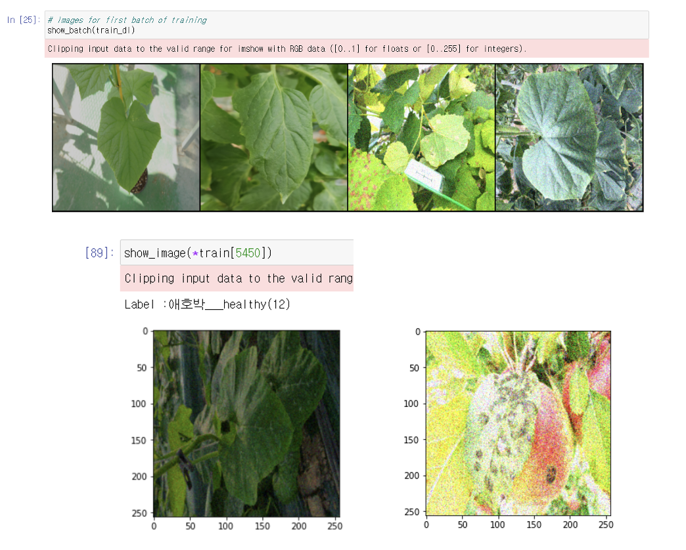
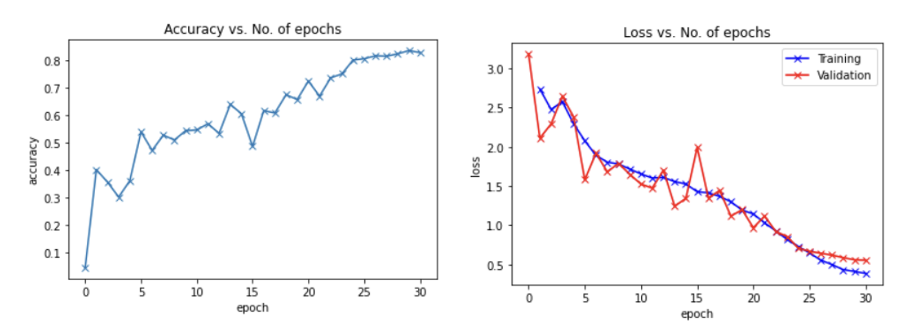
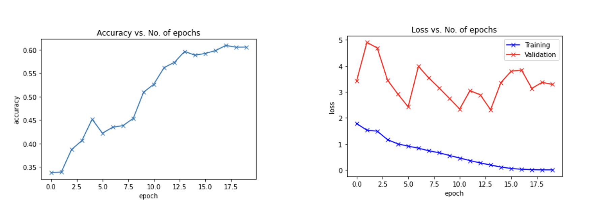
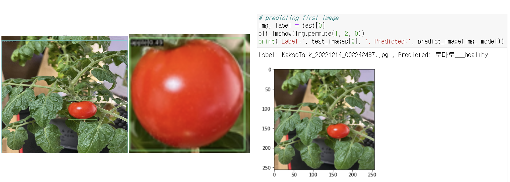

# Plant-disease-detection

<h1 align="center"> Plant disease Classifiacation </h1>

<h5 align="center"> Visual AI Project  (2022-09 ~ 2022-12) </h5>

<h3> Project Instruments </h3>
매년 인구가 증가하면서 많은 종류의 식물과 관련된 제품들이 늘어나고 있지만 많은 소작농들이 생산량의 많은 부분들을 해충과 전염병에 의해 잃고 있습니다.

As the population grows every year, many types of plant-based products are becoming more available, but many smallholder farmers are losing large portions of their production to pests and epidemics.

<h3> Project Goals </h3>
과거 연구보다 범용적인 식물 종류에 대해 탐지를 진행하기 위해 여러 데이터 셋을 결합하여 클래스 수를 기존보다 늘려 범용성을 늘리되 정확도를 유지하는 것입니다.

The idea is to combine multiple datasets to detect plant species that are more universal than past studies, increasing the number of classes to increase universality while maintaining accuracy.

또한, 제가 키우고 있는 방울 토마토인 방울이의 질병 탐지를 진행합니다.

I also do disease detection on my cherry tomatoes, which are called '방울이' .

<h3> Methods </h3>
기존 연구와는 다르게 원본 이미지를 input으로 넣는 것이 아닌, 전체 이미지 + Detection 된 부분의 이미지를 층으로 쌓아서 Resnet에 적용합니다.

Unlike previous studies, we do not input the original image as input, but layer the entire image + the image of the detected part and apply it to Resnet.

<h3> IDEA </h3>
한정된 종류에 해당하는 식물 질병 탐색은 많은 농부에게 불편함과 어려움을 가져다 줄 것이라 생각하여, 더욱 많은 질병을 탐색할 수 있는 분류기를 만들고자 하였습니다. 

클래스를 늘려 정확도가 떨어질 수 있는 상황에서 이를 방지하고자 디텍션을 사용하여 중요한 부분의 이미지를 다시 한번 강조해주어 더욱 더 분류를 잘 할 수 있도록 하고자 하였습니다.

We realized that detecting a limited number of plant diseases would be inconvenient and difficult for many farmers, so we wanted to create a classifier that could detect more diseases. 

To avoid the possibility of increasing the number of classes and decreasing the accuracy, we used detection to highlight the important parts of the image again for better classification.

<h1> Datasets </h1>

##### Kaggle - New Plant Diseases Dataset([https://www.kaggle.com/datasets/vipoooool/new-plant-diseases-dataset](https://www.kaggle.com/datasets/vipoooool/new-plant-diseases-dataset))

총 14개의 식물종과 38개의 정상 및 질병 클래스로 구성 

A total of 14 plant species and 38 normal and disease classes 

##### AIHUB - 식물 병 유발 통합 데이터([https://aihub.or.kr/aihubdata/data/view.do?currMenu=115&topMenu=100&aihubDataSe=realm&dataSetSn=525](https://aihub.or.kr/aihubdata/data/view.do?currMenu=115&topMenu=100&aihubDataSe=realm&dataSetSn=525))

총 12종의 작물 24개의 정상 및 질병 클래스로 구성

A total of 12 crops with 24 normal and disease classes

->> 합쳐서 중복 5개의 클래스를 제외하고 57개의 클래스로 식물 질병 분류

->> In total, 57 classes of plant diseases, excluding 5 redundant classes.

#### Datasets we've built

 

<h1> Process </h1>

1. 우리는 먼저 부족한 데이터셋의 수량을 보충하기 위해 Data augmentation을 진행했습니다. 명암과 노이즈를 통해 데이터를 증진시켰습니다.

We first augmented the data to make up for the lack of quantity in the dataset: we enhanced the data with contrast and noise.

 

2. 이미지를 인풋으로 받아 MMdetection의 CASCADE R-CNN을 진행하여 이미지에서 식물 잎사귀 부분 혹은 열매의 부분 이미지를 추출합니다. 그 이후, 추출한 이미지를 원본 이미지와 크기를 맞춰 이를 원본 이미지에 쌓아 6channel에 해당하는 인풋 데이터를 생성합니다.

Taking the image as input, MMdetection's CASCADE R-CNN is run to extract partial images of plant leaves or fruits from the image. The extracted images are then scaled to match the original image and stacked on top of the original image to create 6 channels of input data.

3. 6채널로 이루어진 인풋 데이터 셋을 RESNET model을 사용하여 분류합니다.

Classify an input dataset of 6 channels using a RESNET model.

<h1> Result </h1>

 

- Detection과정 없이 3channel로 resnet을 이용한 결과입니다.

 

- Detection과정 이후 6channel로 resnet을 이용한 결과입니다. 학습 시간이 부족하여 이전 과정보다 학습이 부족한 상태입니다.
- This is the result of using resnet with 3 channels without detection.

 

- 제가 키우고 있는 방울토마토 '방울이'를 모델에 주입했을 때의 결과를 보여주고 있습니다. 모델은 방울 토마토의 열매 부분을 탐지하였고 탐지한 이미지는 원본 크기에 맞춰 확대합니다. 이후 왼쪽의 두 이미지는 6channel로 결합하여 변형된 Resnet에 의해 질병 탐지가 진행되어집니다.
- This shows the results of injecting my cherry tomato "drops" into the model. The model detected the fruit part of the cherry tomato and the detected image is scaled to the original size. The two images on the left are then combined into a 6-channel and disease detection is performed by a modified Resnet.

🎉 다행히 저의 '방울이'는 건강한 것으로 나타났습니다 ~!!!
Fortunately, my '방울이(Banguli)' turned out to be healthy ~!!!

